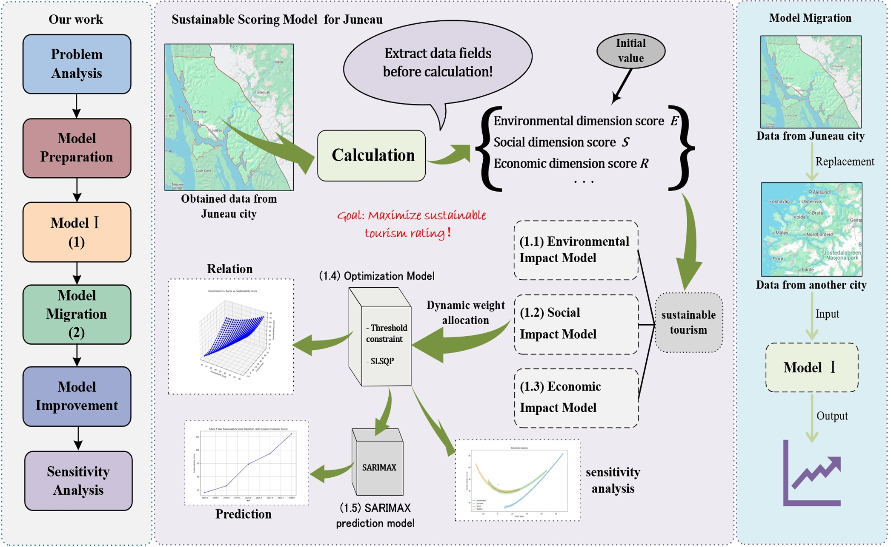

# Towards Sustainable Tourism: A Dynamic Optimization Model for Locations in Trouble

**Team Control Number:** 2520023  
**Problem:** MCM/ICM 2025, Problem B  
**Date:** January 27, 2025  

---

## 📖 Overview

This study develops a dynamic scoring‑and‑optimization framework to balance economic, environmental, social, and stability dimensions of tourism. We apply it to:

- **Juneau, Alaska** (overtourism)  
- **La Sagrada Família & Bunkers del Carmel, Barcelona** (intra‑city balance)  
- **Hawaii Island** (extreme overtourism)  

---
## 🏠 Architecture

## 🎯 Objectives

1. Construct a composite sustainability score  
2. Optimize investment allocations under real‑world constraints  
3. Forecast future sustainability trends via SARIMAX  
4. Test model transferability and sensitivity  

---

## 🧮 Methodology

| Component | Description |
|-----------|-------------|
| **Scoring Model** | Weighted sum of revenue, environment, social, stability scores |
| **Optimization** | Maximize sustainability score subject to minimum score & budget constraints |
| **Forecasting** | SARIMAX time series model for tourism trends |
| **Sensitivity Analysis** | Assess factor importance and model stability |

---

## 📊 Key Results

| Location | Optimal Score | Investment Allocation (%) (Env • Econ • Soc) |
|----------|---------------|---------------------------------------------|
| Juneau, AK | 234.81 | 47.1 • 13.5 • 39.4 |
| La Sagrada Família | 168.67 | 35.1 • 20.3 • 44.6 |
| Bunkers del Carmel | 198.96 | 24.5 • 51.8 • 23.7 |
| Hawaii Island | 216.83 | 32.2 • 11.1 • 56.7 |

**Finding:** Environmental factors exert the strongest influence on sustainability; model remains robust across contexts.  

---

## 🚀 Usage

1. Read full methodology in `MCM2025.pdf`.  
2. Implement scoring & optimization via provided formulas (Sections 4–5).  
3. Fit SARIMAX on annual tourism data for forecasting.  

---

## 📂 File Structure

